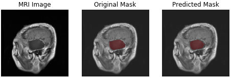
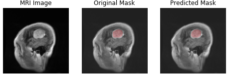
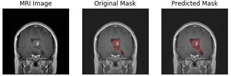
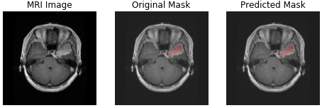

# Brain tumor segmentation in MRI images using U-Net

Here, I have implemented a U-Net from the paper ["U-Net: Convolutional Networks for Biomedical
Image Segmentation"](https://arxiv.org/pdf/1505.04597.pdf) to segment tumor in MRI images of brain.

There are 3 types of brain tumor:
1. meningioma
2. glioma
3. pituitary tumor

## Examples of predicted tumor segment by the current U-Net implementation.
meningioma       	  | glioma		| 	pituitary tumor             
:-------------------------:|:-------------------------:|:------------------------:
  |  		| 
  |  		|  
  |  		|  

